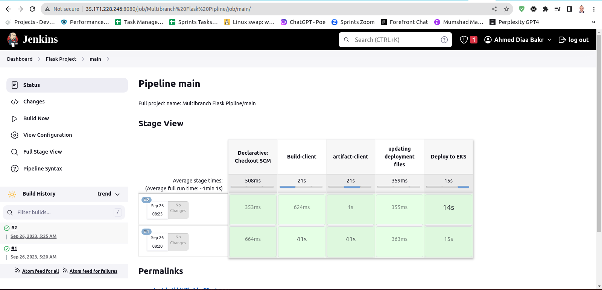

# Full_Capstone_Project_DevOps_Sprints

## Applying terraform

- 

## Running Ansible-playbook

- 

## Docker compose the project

- 
- 

## Adding jenkins credentials

- 

## Creating jenkins multi-branch pipeline

- 

## Configuring pipeline

- 
- 
- 

## node public ip address & ingress dns address

- 

## Editing EKS cluster Security group

- 

## Opening website from node port or dns

- 
- 

## Testing website

- 
- 
- 
- 

## Linking github through webhook

- 
- 

